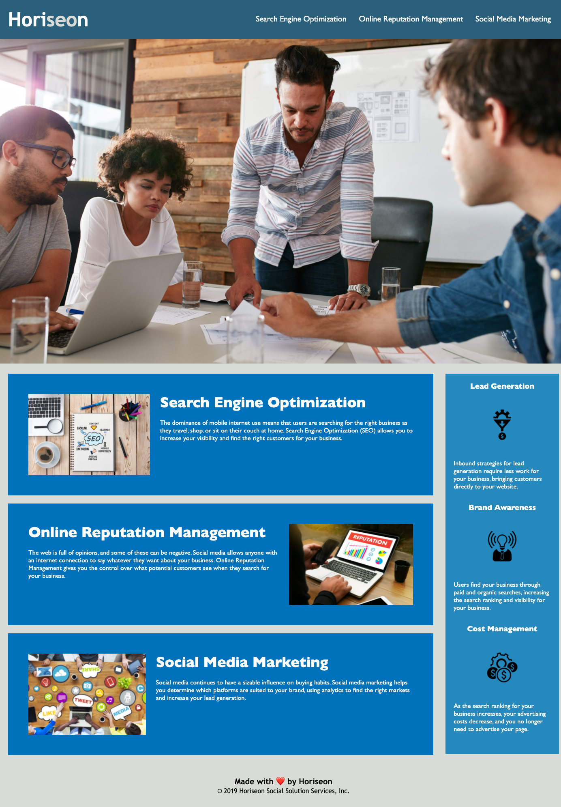

# Horiseon Accessibility Refactoring Project

## Introduction

For this project we were assigned the task of making Horiseon Marketing's landing page HTML semantic. 
HTML semantics are important because they make webpages more accessible and readable, especially for people with disabilities and people who use assistive technology. 

## Refactoring

Because we were only refactoring this page we didnt change the format or funciton of the landing site, we simply changed the exsiting div tags into more sematic tags. 

>**For example**: Assigning header and footer, instead of div class="header". This will help the landing page meet accessibility standards.

**Note**: All necessary commits are recorded in the repository commit history.

## Product

The following image shows the final webpage after refactoring. As you can see, the webpage aesthetics and functions did not change, but someone using assistive technology will have a more streamlined and functional experince with the webpage.

**Link to published webpage**: 
https://hannahcallison.github.io/horiseon-accessibility/
